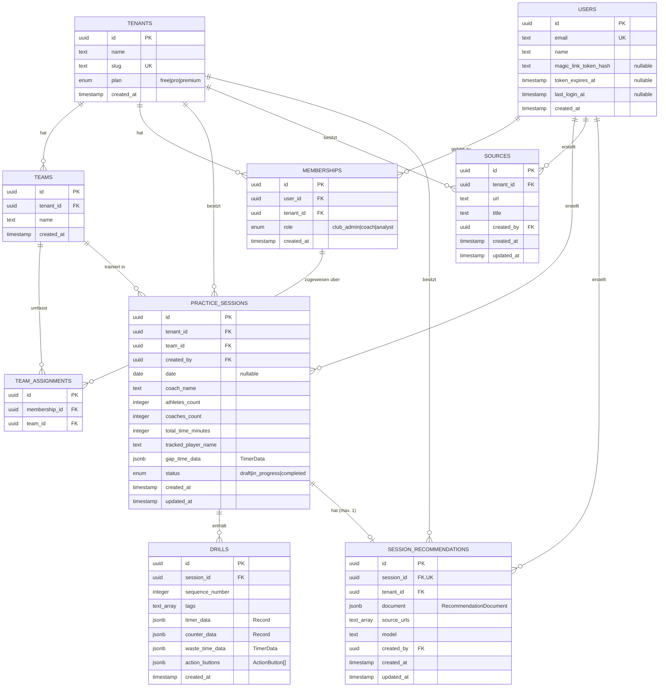

# Entitäten-Modell (ER)

Datenmodell von PET v2, abgeleitet aus dem Drizzle-Schema
(`packages/server/src/infrastructure/db/schema.ts`) und den Shared-Types
(`packages/shared/src/types.ts`).

PET ist eine Multi-Tenant-SaaS: Ein **Tenant** (Verein) ist die oberste
Mandanten-Grenze, fast alle Daten hängen direkt oder transitiv an einem Tenant.

## Diagramm

## Entitäten

### Tenant (`tenants`)
Mandant / Verein — oberste Isolationsgrenze der SaaS. Trägt den Abo-Plan
(`free | pro | premium`) und einen eindeutigen `slug`.
- **1 : n** Teams, Memberships, Practice Sessions, Sources, Recommendations.
- Löschen kaskadiert auf Teams, Memberships, Sessions, Sources, Recommendations.

### User (`users`)
Globale Identität, **nicht** an einen Tenant gebunden (eine E-Mail = ein User,
kann in mehreren Tenants Mitglied sein). Magic-Link-Auth: `magic_link_token_hash`
+ `token_expires_at` halten das ausstehende Login-Token.

### Membership (`memberships`)
Verbindungstabelle User ↔ Tenant mit **Rolle** (`club_admin | coach | analyst`).
Trägt damit das gesamte Rollenmodell (siehe ADR 0004).
- Eindeutig pro `(user_id, tenant_id)` — ein User hat pro Tenant genau eine Rolle.

### Team (`teams`)
Mannschaft innerhalb eines Tenants.
- **n : m** zu Memberships über `team_assignments`.
- **1 : n** Practice Sessions.

### TeamAssignment (`team_assignments`)
Reine Zuordnungstabelle Membership ↔ Team (n:m).
- Eindeutig pro `(membership_id, team_id)`.

### PracticeSession (`practice_sessions`)
Eine getrackte Trainingseinheit. Die `id` wird vom Client vergeben (Offline-First,
Dexie → Sync), daher kein DB-`defaultRandom`. Aggregierte Kennzahlen
(`athletes_count`, `total_time_minutes`, …) plus `gap_time_data` (TimerData) für
die übergreifenden „Time-Moving"-Episoden.
- **1 : n** Drills (Cascade-Delete).
- **1 : 0..1** SessionRecommendation.
- `status`: `draft → in_progress → completed`.

### Drill (`drills`)
Einzelne Übung innerhalb einer Session, geordnet per `sequence_number`.
JSONB-Felder spiegeln die framework-agnostischen Tracking-Strukturen:
`timer_data`/`counter_data` als `Record<buttonId, …>`, `waste_time_data` und die
konfigurierten `action_buttons`.

### Source (`sources`)
Vom Tenant gepflegte Referenzquellen (URL + Titel), die als Wissensbasis für die
KI-Empfehlungen herangezogen werden.

### SessionRecommendation (`session_recommendations`)
KI-generierte Empfehlung, **1:1 an eine synchronisierte Session gebunden**
(`session_id` unique — siehe ADR 0006). Speichert das strukturierte
`document` (RecommendationDocument), die verwendeten `source_urls` und das `model`.

## Beziehungs-Notation

| Symbol | Bedeutung |
|--------|-----------|
| `||--o{` | 1 : n (eins zu vielen) |
| `||--o|` | 1 : 0..1 (eins zu höchstens eins) |
| `PK` / `FK` / `UK` | Primär- / Fremd- / Unique-Key |

## Hinweise

- Mandanten-Isolation: Sessions, Sources und Recommendations tragen `tenant_id`
  redundant (auch wo über das Team ableitbar), um Tenant-Scoping in Queries und
  Indizes ohne Joins durchzusetzen (`*_tenant_id_idx`).
- Audit-Felder: `created_by` referenziert `users` ohne Cascade — User bleiben für
  die Historie erhalten, auch wenn Memberships entfernt werden.
- Verwandte Entscheidungen: `docs/adr/0004` (Rollenmodell),
  `docs/adr/0006` (Recommendation ↔ Session), `docs/adr/0001` (Time-Moving-Episoden).
